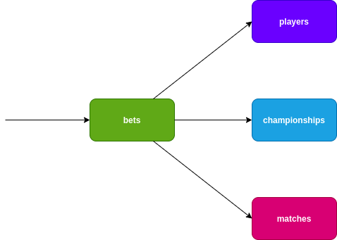

# Manifests for Bets application

This repo contains helm templates to deploy **Bets Application**

## Bets Big Picture

## For Argo Rollout

The [rollout](rollout) path contains manifests to work with [Argo Rollout](https://argoproj.github.io/argo-rollouts/) 

You should have a k8s cluster with Istio,ArgoCD,Argo Rollout then you are able to apply these manifests.

## For Istio, Kong and Linkerd

The [stable](stable) path contains manifests to work with Istio, Kong and Linkerd, each one has a specific values.yaml.